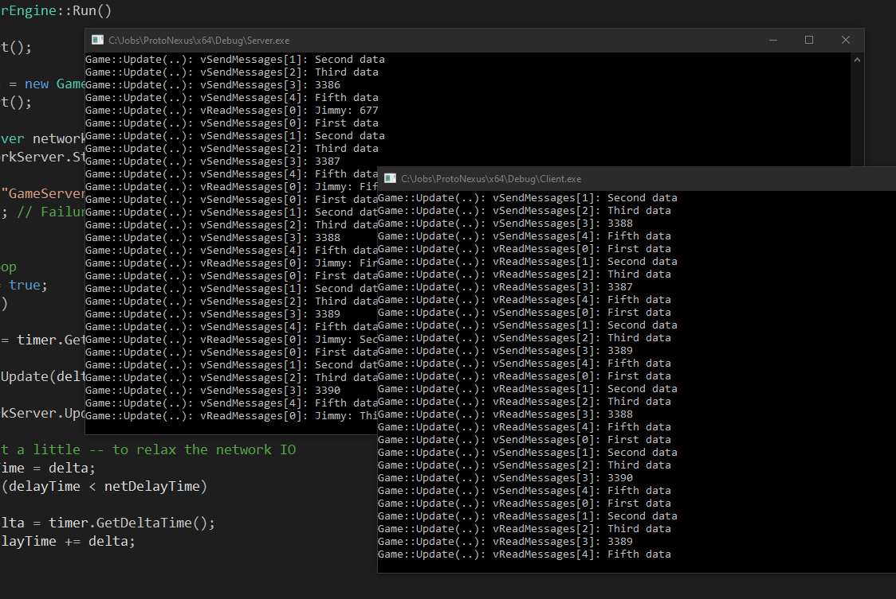

# ProtoNexus

A project that focused on making the TCP network IO as transparent as possible. This would make it easier to implement multiplayer to a game. It was meant as a template for further game development. On nice little feature with SFML are this it is multiplatform, so no need to dig into network APIs like Winsock or Berkeley-sockets. Also tried out a new way in printing out text based on its function, i.e: an error occurred or network related message etc. It was handy just change a line of code to enable/disable a certain type of message, since the terminal was flooded with scrolling text. One thing I figured out was that it was smart to make two central methods for the actual networking IO, this lessened the need to error checking everywhere. Both the server and client is single-threaded, to lessen possible errors. The goal was to make it as stable as possible for networking and to verbosely print messages if needed. This turned out to be a wise choice, it made it easy to detect potencial problems while developing this project. I had to learn SFML network and one thing I found a bit confusing at first was the SFML socket selector. After fiddling with it a while I figured it out. Not that hard really. Once understod it made it possible to handle multiple clients. Prior to this I had only managed to play around with server and only one client. Another goal with this project was to find a way for the server and clients to send and receive messages from a game class perspective. I found it easy to just implement it with std::vector both ways. That said, I probably should have used a struct so that you would not need to decode who the message was from. One final note is that I have hardcoded the servers IP to local host (127.0.0.1) since this made the development iterations faster. The last thing I had to do was to slow down the server and client to wait 50 ms each loop. Reason was that the terminal struggled to keep up (maybe it was the NIC).

Tags: C++, SFML, TCP Server & Client, Game
